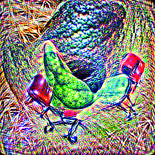

# TinyVisions

by [crumb](https://twitter.com/aicrumb)




`an avocado armchair`

### Use

##### GPU:

```
git clone https://github.com/openai/CLIP && pip install -e ./CLIP
python tinyvisions.py "prompt" 2000
```

where 2000 is the iterations, and "prompt" is .. your prompt

##### CPU:

change line 11 from `d='cuda'` to `d='cpu'`, then use as instructed above


#### Notebook

(Don't use the notebook on colab's k80s. it's way too slow. please. for your own sanity, it's in there if you "want" to use it though)
